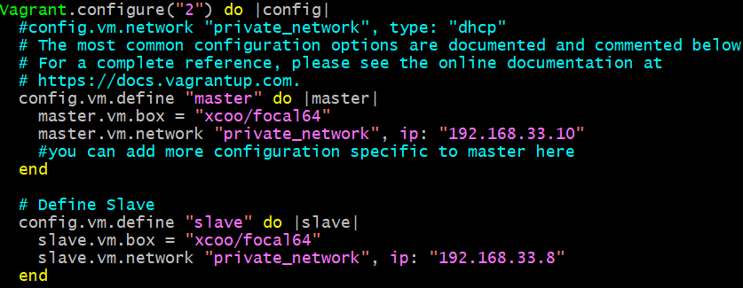
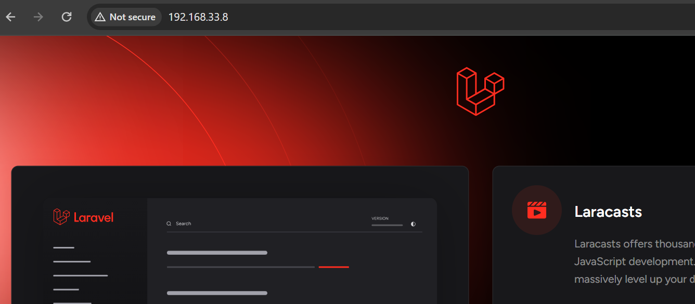
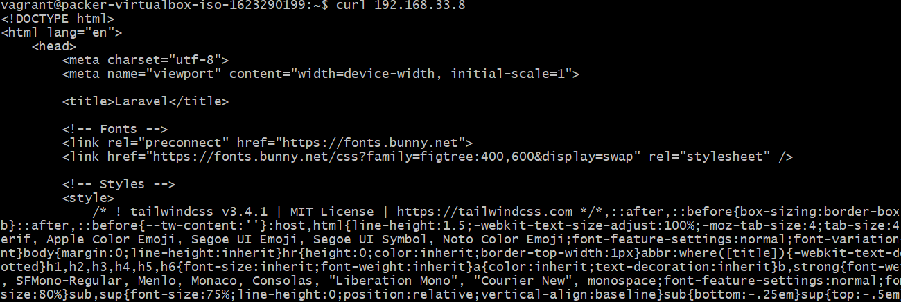
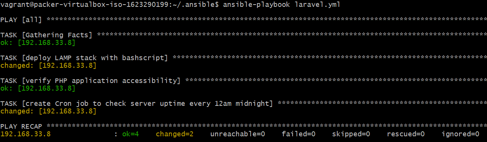

# Deploy LAMP Stack

- Automate the provisioning of two Ubuntu-based servers, named “Master” and “Slave”, using Vagrant.

- On the Master node, create a bash script to automate the deployment of a LAMP (Linux, Apache, MySQL, PHP) stack.

- This script should clone a PHP application from GitHub, install all necessary packages, and configure Apache web server and MySQL.

## Using an Ansible playbook; 
- execute the bash script on the Slave node

- verify that the PHP application is accessible through the VM’s IP address

- create a cron job to check the server’s uptime every 12 am.

